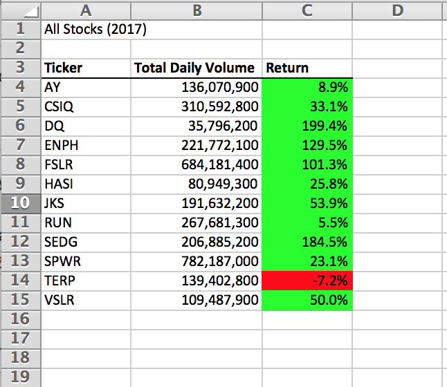
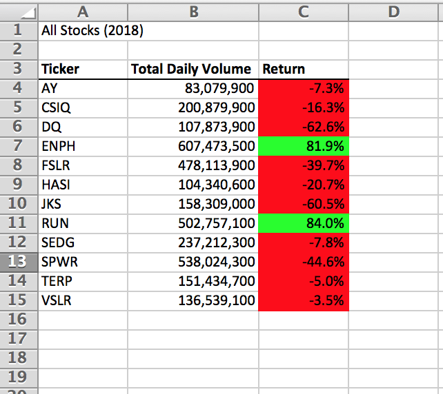
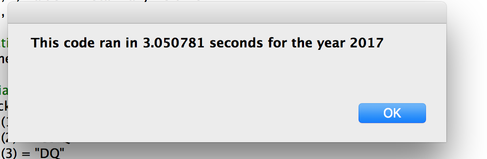
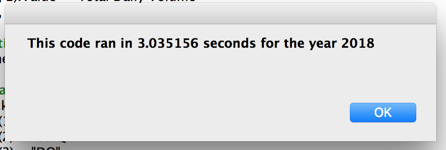
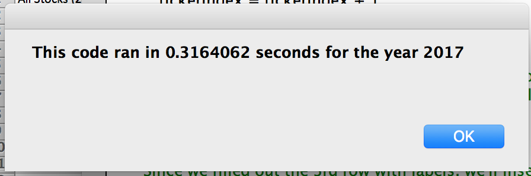
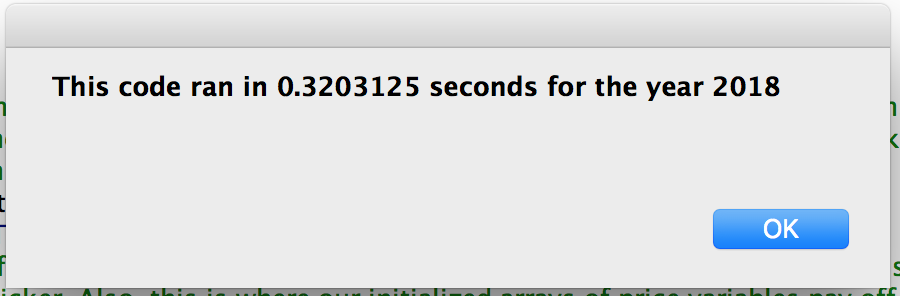

# Stocks Analysis with VBA
Our patron Steve has loved using our VBA code to analyze datasets of stock data, and he has a new request for us: make a VBA script that analyzes data of the entire stock market.
For this ambitious request, we'd want our code to run as efficiently and cleanly as possible. Hence, we'll update some of our VBA code and measure how quickly that code executes compared to the original code.

## Changes to Code ##
In the original code, as seen in 2.3.3 (2021), we ran a nested for loop that performed several functions, chiefly sifting through each dataset row and posting analysis data (like total daily volume) for each stock ticker in a given year. Per Module 2's Challenge Instructions (2021), instead of a nested for loop, we'll try and run a simpler, singular for loop that iterates only through the dataset's rows. Additionally, this new code will have us post the analysis data outside the for loop. In this case, instead of using a 2nd for-loop parameter to reference each ticker, we'll use a tickerIndex that will increment each time we reach a new ticker on the spreadsheet. On the downside, since the new for loop does not automatically post analysis data for each ticker, we will have to create three arrays, each of which will hold variables that contain each stock's total daily volume, starting prices, and ending prices. That way, once we code VBA to post the analysis data, we can refer to the corresponding volume or price of a given stock tickerIndex.

## Stock Results ##
With our new code, we find that the twelve stocks have been a bit volatile between 2017 and 2018. For 2017, as seen in the below image, **the vast majority of stocks performed reasonably well**. Particularly, **AY** and **RUN** both saw comparatively small returns – **at 8.9% and 5.5% respectively** – for the year. The lone stock that lost out on those gains, TERP, only suffered a 7.2% loss of return, signaling that 2017 was an overall good year for the twelve stocks.

The same can't be said for 2018, however. Only 2 stocks saw positive returns – **ENPH (+81.9%)** and **RUN (+84.0%)** – while the rest suffered setbacks, though to varying degrees. While several stocks like **AY** and **SEDG** only **lost a modest 7-8% of their value**, others like **DQ** and **JKS** suffered greater losses, **peaking at around 60% loss of stock value**.

While it may be confusing to evaluate how each stock performed from 2017 to the end of 2018, it is nonetheless doable. As an example, **DQ** in 2017 experienced a great leap in value at nearly **200%**. In other words, if **DQ** stock was evaluated to be worth $100 at the start of 2017, then by the end of 2017, that **DQ** would be worth about $300. Come 2018, the stock vastly underperformed its colleagues, losing around **60%** of its value by the end of 2018. Continuing our earlier example, since **DQ** stock was worth $300 at the start of 2018, then the value dropped to about $120. Compared to $100 back in early 2017, that's a net **20%** jump in value for **DQ**.

We must also note that this analysis has a few limitations. For one, it only considers year-to-year values and not shorter time periods like month-to-month or quarter-to-quarter. Another limitation is that this analysis only looks into stock statistics over two years. For any investors that want to buy low and sell high at the opportune time, they would certainly want to know more about each stock's seasonal trends, as stocks go up and down in value all the time.

## Code Runtime Results ##
In the background, we have also used VBA's Timer function to measure code execution performance. With the original code built during Module 2 lessons up to 2.3.3 (2021), we find that the code took about **3 seconds** to run for each year selected.

Doing the same for the updated code, we see a **drastic reduction of time: from 3 seconds to around 0.3 seconds.**

With a **near 90%** reduction in execution time, we find great promise in applying this new code for much larger data sets like the complete stock market. All other factors considered, if the original code takes 3 seconds to analyze 12 stocks, then that code would take 60 seconds to analyze 240 stocks. By comparison, at the new code's rate of 40 stocks a second (or 12 / 0.3), it would only take 6 seconds. With more and more stocks to deal with when analyzing the entire stock market, the benefits of faster running code will undoubtedly be reaped.

Granted, this optimistic prediction does come with some caveats. For one, this assumes we have easy access to data of every stock in the stock market inside an Excel Workbook file. It also assumes all the data is formatted the same, without any null entries or mislabeled information in any row. Not to mention that the performance benefits of the optimized code were observed on one computer thus far. Further testing is needed to better gauge the execution times of the original and new code.

## Conclusions on Refactoring ##

In creating the new code with the aid of refactoring, we have come across benefits and drawbacks. On one hand, refactoring prior working code is very useful for setting the foundation of future working code, especially code done on the same coding environment (software, OS, etc). With a foundation code in place, there is no need to code out everything. On the other, however, as we have found, refactored code is not always the ideal solution for a coding problem but rather a starting point. As an example, while we used the original code as a template on how VBA for loops should be built, **we had to adapt that code to suit a single for loop AND a tickerIndex variable**. In addition, the original code did not have arrays of stocks' daily volumes, starting prices, and ending prices. Seeing how the original code computed each stock's statistics, we had to be creative and create those arrays as reference for the stocks' final total daily volumes and returns. In essence, while refactoring code helps speed up the coding process, it is not always the final step for fully functioning code.
